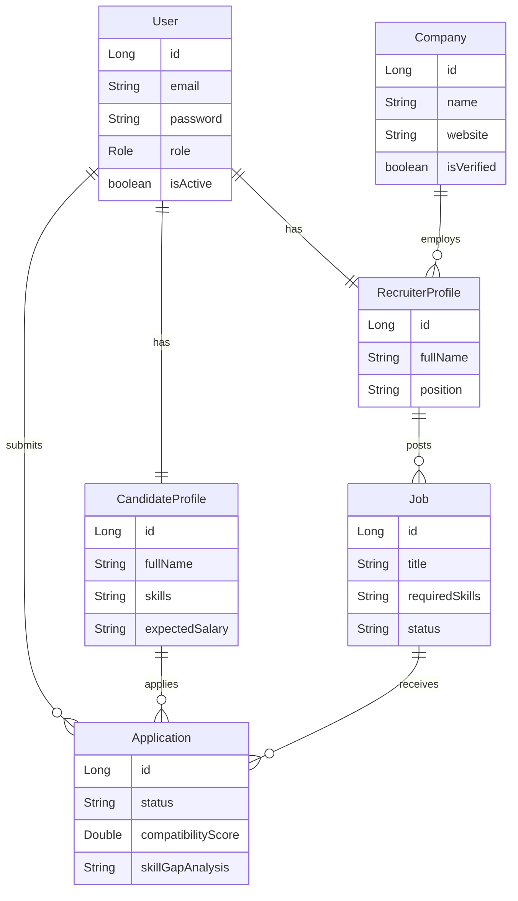

# AI Job Portal SaaS 🚀

A production-ready Full-Stack AI Job Portal built with Spring Boot and React.

## 🌟 Key Features

- **Smart Resume Analysis**: Extracts skills from uploaded PDFs and compares them against job requirements.
- **Explainable Candidate Ranking**: Ranks candidates and provides human-readable explanations (e.g., "+ Strong Java", "- Missing Docker").
- **Skill Gap Map**: Shows candidates precisely what skills they are missing for a given job.
- **Application Health Score**: Evaluates the probability of an application's success based on AI models.
- **Application Journey Tracker**: Visual pipeline tracking from Applied to Hired.
- **Role-Based Access Control**: Separate portals for Job Seekers, Recruiters, and Admins.

## 🛠 Tech Stack

**Backend**: Java 17+, Spring Boot 3, Spring Security, JWT, Hibernate/JPA, MySQL, Maven, OpenAPI (Swagger), Apache PDFBox.
**Frontend**: React 18 (TypeScript), Vite, Tailwind CSS, React Router, Lucide React, Axios.

## 🏗 Architecture

The backend follows a clean Layered Architecture (Controller → Service → Repository) using DTO patterns and global exception handling. Passwords are mathematically hashed using BCrypt, and sessions are stateless using JWT access and refresh tokens.

---

## 🚀 Setup Instructions

### 1. Database Setup
1. Install MySQL and start the server.
2. Create a database named `job_portal`:
   ```sql
   CREATE DATABASE job_portal;
   ```
3. Update `backend/src/main/resources/application.properties` with your MySQL credentials.

### 2. Backend Setup
1. Navigate to the `backend` folder: `cd backend`
2. Build the project: `mvn clean install`
3. Run the application: `mvn spring-boot:run`
4. The backend will run on `http://localhost:8080`.
5. Access the Swagger API Documentation at: `http://localhost:8080/swagger-ui/index.html`

### 3. Frontend Setup
1. Navigate to the `frontend` folder: `cd frontend`
2. Install dependencies: `npm install`
3. Start the dev server: `npm run dev`
4. Access the UI at `http://localhost:5173`

---

## 🗄 Database ER Diagram



## 🔐 Security & Fraud Controls
- **JWT Authentication**: Secure stateless auth with short-lived tokens.
- **RBAC**: Endpoints secured via `@PreAuthorize`.
- **Fraud Controls**: Jobs with suspicious links or unverified companies are flagged for Admin Review before being published.

## 📄 Postman & Testing
- Unit and Integration tests are located in `backend/src/test`.
- Postman Collection can be derived directly from the OpenAPI/Swagger specification at `http://localhost:8080/v3/api-docs`.
